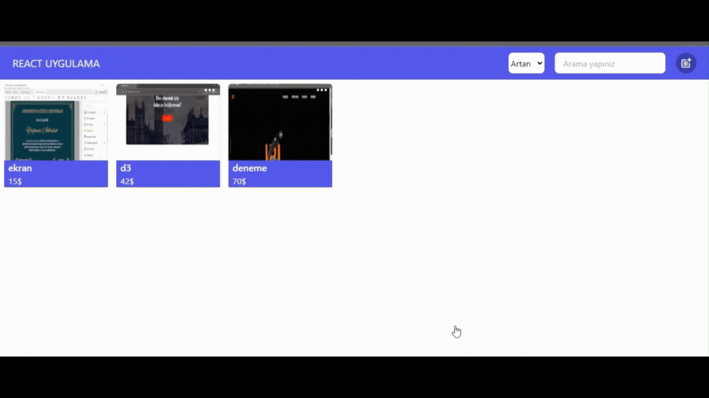

- Bu proje, React ve Redux kullanılarak oluşturulmuş bir ürün yönetim sistemidir. Bu sistemde, kullanıcılar ürün ekleyebilir, mevcut ürünleri güncelleyebilir, silebilir ve ürünleri arayarak filtreleyebilirler. Kullanıcı arayüzü, açılır modallar kullanılarak etkileşimli hale getirilmiştir.

# Kullanım
# Ürün Ekleme
- Ana sayfada sağ üst köşede bulunan "Ürün Ekle" butonuna tıklayın.
- Açılan modalda ürün adı, fiyat ve resim gibi bilgileri girin.
- "Ürün Oluştur" butonuna tıklayarak ürünü ekleyin.

# Ürün Güncelleme
- Güncellemek istediğiniz ürün kartının üzerine gelin.
- Ürün kartında bulunan "Güncelle" butonuna tıklayın.
- Açılan modalda gerekli değişiklikleri yapın ve "Ürün Güncelle" butonuna tıklayın.

# Ürün Silme
- Silmek istediğiniz ürün kartının üzerine gelin.
- Ürün kartında bulunan "Sil" butonuna tıklayın.
- Ürün sistemden kaldırılacaktır.

# Ürün Arama ve Filtreleme
- Ana sayfanın üst kısmında bulunan arama kutusuna aramak istediğiniz kelimeyi girin.
- Girdiğiniz kelimeye göre ürünler dinamik olarak filtrelenecek ve ekranda gösterilecektir.

## ScreenCast

